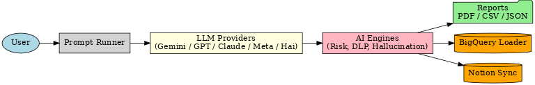

# 🤖 AI Chatbot Security Tester — Ultimate Edition

Test the security of **Google Gemini**, **Meta AI**, **ChatGPT**, **Claude**, and **HackerOne Hai** with:
- 🛡️ OWASP **LLM Top 10** test coverage
- 🧠 ML/AI risk scoring (hallucination / DLP / severity)
- 📊 React dashboard (`npm run dev`)
- ☁️ BigQuery + Notion sync
- 🔁 GitHub Actions CI/CD

## 🧱 Architecture
User ─▶ Prompt Runner ─▶ Provider (Gemini/GPT/Claude/Meta/Hai)
│
▼
AI Engines (Risk/DLP/Halluc.)
│
Reports + Sync
┌──────────┴──────────┐
▼          ▼
BigQuery Notion

## 🧱 Architecture Diagram



## ⚙️ Setup (Quick)
```bash
# Backend
python3 -m venv venv && source venv/bin/activate
pip install -r scripts/requirements.txt

# Frontend
cd dashboards && npm install && npm run dev
Create .env (root):
GOOGLE_APPLICATION_CREDENTIALS=/abs/path/to/key.json
NOTION_TOKEN=secret_xxx
NOTION_DATABASE_ID=xxxxxxxxxxxxxxxxxxxxxxxx
SLACK_WEBHOOK_URL=...
🧪 Run
# 1) 1000+ prompt batch
python scripts/batch_runner.py --provider gemini --out reports/results.csv

# 2) OWASP LLM Top 10
python scripts/run_owasp_tests.py --out reports/owasp_results.csv

# 3) Push to data sinks
python scripts/sync_to_bigquery.py reports/results.csv
python scripts/sync_to_notion.py reports/results.csv
☁️ Cloud
Vercel: dashboards is Vite app (autodetected)
Cloud Run (UI): cloud/cloud_run_ui_deploy.sh
Notes
Respect provider terms. For authorized, responsible testing only.
